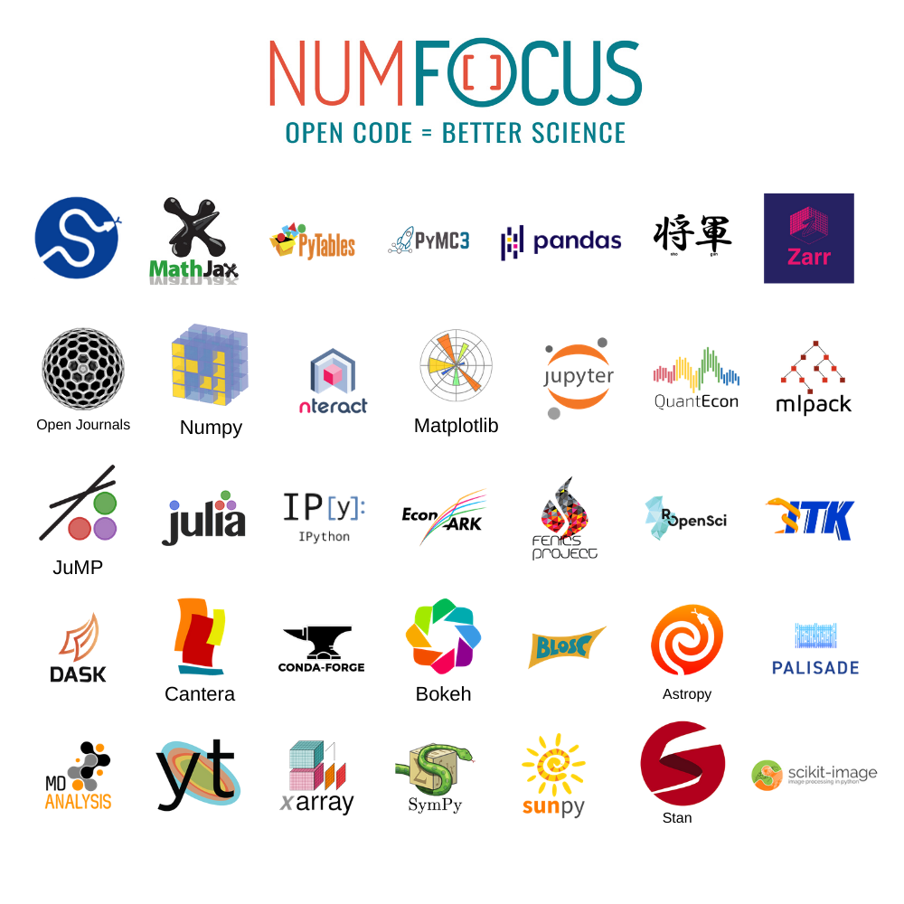

# PyData

PyData é o programa educacional da NumFOCUS.

O [PyData](https://pydata.org/) proporcional um fórum para a comunidade internacional de usuários e desenvolvedores de ferramentas de análise de dados para compartilharmos ideas e aprendemos uns com os outros.

Existem quase 200 grupos em quase 70 países diferentes: https://www.meetup.com/pro/pydata/

Em Belo Horizonte tem o grupo do [Telegram PyData BH](https://t.me/pydatabh):


A [NumFOCUS](https://numfocus.org/) (Numerical Foundation for Open Code and Useable Science) é uma organização sem fins lucrativos que promove práticas abertas de pesquisa, dados e computação científica.



## Gitpod


No terminal, instalar e definir a versão estável mais atual do Python:
```sh
pyenv install 3.9.5
```

```sh
pyenv global 3.9.5
```

### Instalação das dependências de desenvolvimento

```sh
pip install --requirement requirements_dev.txt
```

No gitpod dá um erro, e a solução está disponível abaixo:
[ERROR: Can not perform a '--user' install.](https://github.com/gitpod-io/gitpod/issues/1997)

```sh
export PIP_USER=false
```
